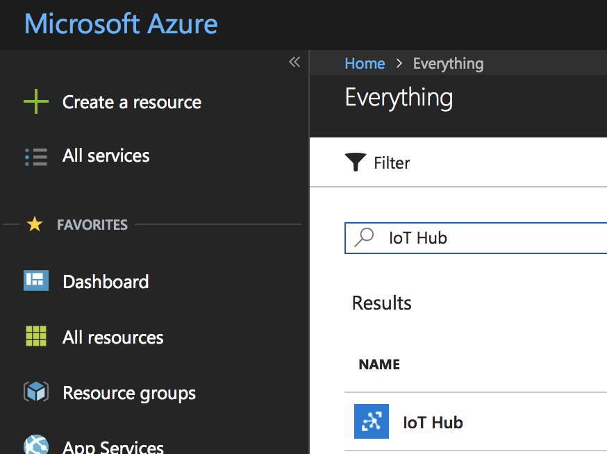
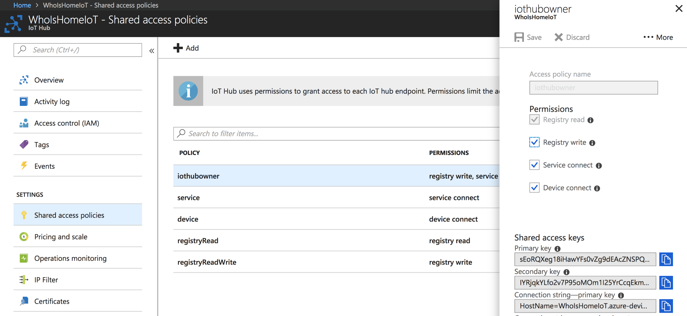
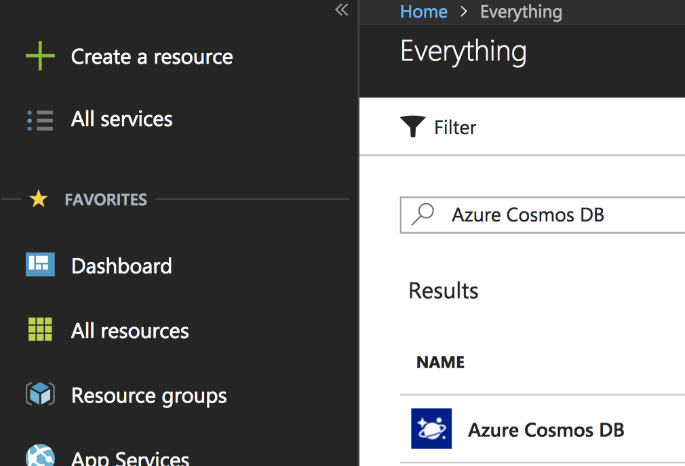
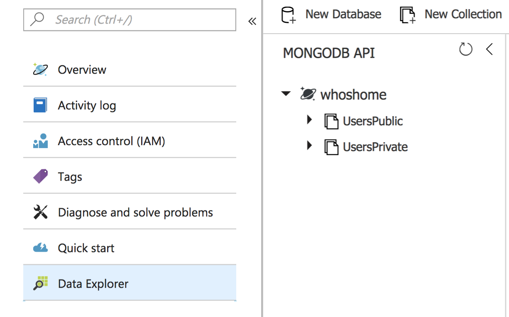
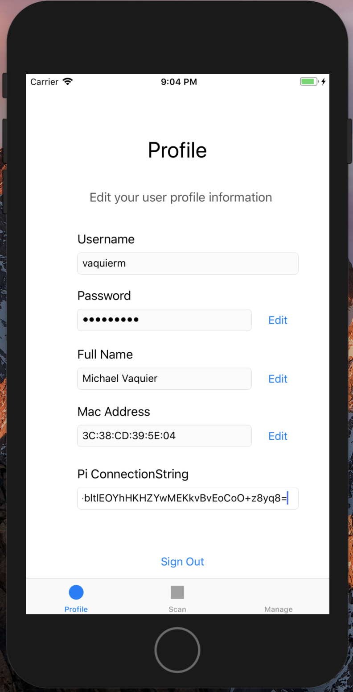
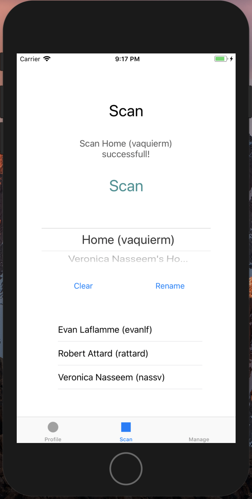
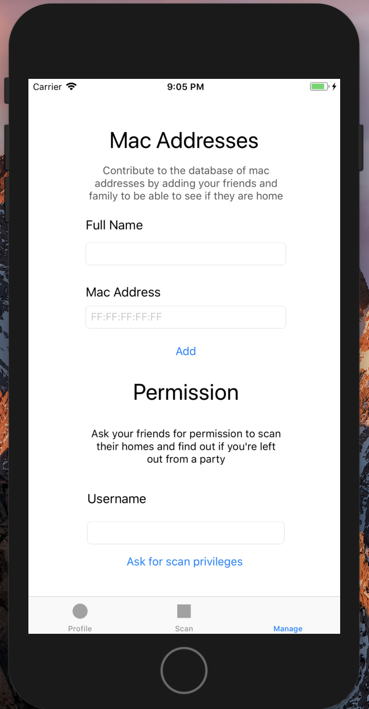

# Who's Home
Who's home is an application that creates a network of users with a fleet of IoT devices for users to see what their peers are up to.
The application could be used for many different scenarios like checking if your roommates are home, to know that your friends got home safely in the evening and many more.

Using the application is simple and can be done with these simple steps. (More details below)
1. Install the mobile application on your iOS or android device.
2. Create an account with the mac address of a device that you always carry with you.
3. Install the NodeJS application on a RaspberryPi (Make sure your Pi is connected to internet).
4. Use the connection string generated for you when creating your account for your Pi to connect to the IoT service.
5. Select the scan tab in your mobile app and click on the scan button. This should scan all registered Who's Home users connected on the same local network as your Pi.
6. If someone does not want to register to Who's Home but you still wish to scan their presence in the scans, you can register their mac address in the features tab without creating an account.
7. Finally request permissions to your friends by username to scan their homes and expand your network.

With this application, you can quickly checks if your friends are home without the hassle of contacting them and impatiently waiting for an answer.

## What is needed to run the application?
- A Microsoft Azure account with an IoT Hub service and a Cosmos Database
- A Raspberry Pi
- And an iOS or Android (still in development) mobile device

### Setting up Microsoft Azure
First create an Azure account.
When on the portal, you can click on 'create resource' and search for 'IoT Hub'.



Once created find your 'Owner connection string' by navigating to 'Shared Access Policies' and clicking on 'iothubowner'. The primary connection string found here will later be referred to in this document as the 'IoTOwnerConnectionString'.

<p align="center">
  
</p>

Next you need to create the Cosmos database. Create it the same way as you did for the IoT hub by clicking on 'create resource' and search 'Azure Cosmos DB'.



Once the resource is created you need to create the actual document collections. You need to create two collections, one which will hold the public user data and another that holds the private data.

Navigate to 'Data Explorer' and click on 'New Database'. Next, right click on the newly created database and select 'New Collection'. Repeat the last step and create another collection under the same database. The result should look like this.



Finally the authentication keys to interact with the database need to be obtained. To do so, navigate to 'Connection String' and get the primary password. That will be referred to as the 'DatabasePrimaryKey' from now on. The other piece of information needed is the API endpoint of the database that you can get by navigating to 'Overview'; it is the Uri that should look something like this.
`https://<YourDatabaseAccountName>.documents.azure.com:443/`

## Mobile Application
The mobile application is the main interface used by an everyday user. A registration system is used to ensure that you and your authorized friends are the only people allowed to scan your home. Once an account is created with the mac address of a device that stays with the user at all times, a connection string is generated for your Raspberry Pi to connect to the IoT hub (More on what to do with it later). When the Pi starts running, the user can scan its home to discover all registered devices connected to the network.
A registered device can be one of two things:
- A device with a mac address that was used to create an account
- A device with a mac address that was later added by a user.

If a peer does not want to register to Who's Home you can still add the mac address of your peer with their full name to still be able to see their presence on your local network.

The other feature is the network of permissions. A user can request another user through their username to be able to scan their home as well. This can allow a user to have a registry of different homes they can scan to see what everyone is up to.

### How it works
The mobile app is a Xamarin Native Multiplatform Mobile application written in C# to target iOS and Android (still in development) devices. When users are created, an IoT device is created on the IoT hub and the connection string is returned to the user. All user data and the permission vectors are stored in JSON form in the Cosmos Database. The Newtonsoft Json package is used for all deserialization and serialization of data.

<p float="left" align="center">
  
   
  
</p>

#### Packages Used
- [Newtonsoft.Json](https://www.nuget.org/packages/Newtonsoft.Json/) for handling data
- [Microsoft.Azure.DocumentDB.Core](https://www.nuget.org/packages/Microsoft.Azure.DocumentDB.Core/) to interact with the database
- [Microsoft.Azure.Devices](https://www.nuget.org/packages/Microsoft.Azure.Devices/) to interact woth the IoT Hub

### How to get set up
To run the mobile application open the 'whoshomemobile' solution with Visual Studio 2017 with Xamarin installed. Open the file `Authorization.cs` and fill the missing string fields with your IoT owner connection string, the database api endpoint and the name of the database and collections as well as the primary key.

The application is then ready to be built and deployed onto your device!

## Gateway application
The gateway application runs on the RaspberryPi. It is what scans your local network and returns the information of everyone that is home when requested by a user from the mobile application.

### How it works
The gateway application runs on a NodeJS framework. When a request is received, a scan of the local network is performed using nmap and the mac addresses discovered are matched with the ones registered in the user data stored in the Azure cosmos database.

#### Packages used
- [namap](https://github.com/jas-/node-libnmap) To perform the scans of the local network
- [DocumentDB](https://github.com/Azure/azure-documentdb-node) To access the database
- [Azure IoT Sdk](https://github.com/Azure/azure-iot-sdk-node) To receive commands from the IoT platform

### How to get set up
For the application to work, you need your Raspberry Pi to be connected to your local network.
Make sure that your Pi has NodeJS installed by running the command
`$ node -v`
If not you can install it by running
```
$ sudo apt-get install curl -y
$ curl -sL https://deb.nodesource.com/setup_8.x | sudo -E bash -
$ sudo apt-get install -y nodejs
```
Clone to repo and navigate to `WhosHome/whoshomegateway/` then run ` $ npm install`

Next, the authentication information has to be set in the `config.json` file.
Open the file and replace the string by your Pi's IoT Connection string (Generated when an account to Who's Home is created from the mobile application), your database API endpoint and primary key as well as the name of your database and the public collection.

You can then run the program with the command
`$ sudo node app.js`
Here it is very important that you use the keyword `sudo` because it is necessary to have the permissions to get the mac addresses of devices when scanning using nmap.

You should get a few print statements indicating that the connection to the database and the IoT Hub have been made.
```
[Cosmos DB Client] Connect success!
[IoT hub Client] Connect success!
```
Your Pi is now ready to be scanned.

